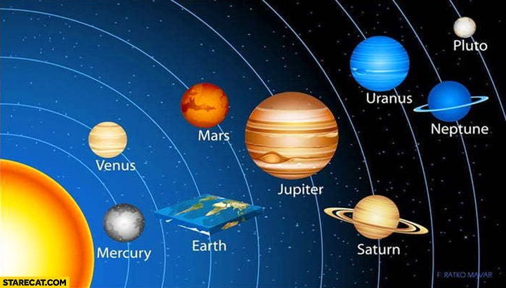

# FCSC 2025 Un cercle est un carré

Alice et Bob vivent sur une planète particulière : celle-ci n’est ni plate, ni sphérique, c’est un cube ! Ils souhaitent optimiser leur connexion filaire en surface afin de minimiser la latence de leurs communications.

Le cube a une dimension 32x32x32 et la format des points où vivent Alice et Bob est le suivant `[0,2,14]` ou `[32,28,11]`. On remarque que ces points se situent bien sur la surface de leur planète.

Pour minimiser les communications filaires, Alice et Bob ont besoin de trouver la plus courte distance *en surface* entre une série de paires de points. Pour simplifier les calculs, et afin de ne conserver que des valeurs entières, on attend le carré de la distance du chemin le plus court (sur la surface) entre chaque paire de points.

En reprenant l’exemple précédent, le chemin de distance minimale attendue entre les points `[0,2,14]` et `[32,28,11]` serait 3789. Ce chemin passe par le point `[13,0,0]`.

**Note :** le fichier fourni `un-cercle-est-un-carre.py` consiste en la partie serveur qui répond au service. Nous ne donnons pas le fichier `minimum_distance.py`. Celui-ci est référencé car il est utilisé pour vérifier vos réponses : votre objectif est d’écrire la fonction `minimumDistanceOnCube`.

Auteur : Neige

Origine : [Un cercle est un carré](https://hackropole.fr/fr/challenges/misc/fcsc2025-misc-un-cercle-est-un-carre/)

## Challenge
[files/un-cercle-est-un-carre.py](files/un-cercle-est-un-carre.py)

-----------

## Installation manuel
Vous n'utilisez pas l'application **les CTFs de Cyrhades** ? C'est dommage !
Mais voici comment installer ce CTF manuellement :

> git clone https://github.com/Hack-Oeil/fcsc2025-misc-un-cercle-est-un-carre.git

> cd fcsc2025-misc-un-cercle-est-un-carre

> docker compose up

-----------

## Sur le site officiel hackropole.fr
> https://hackropole.fr/fr/challenges/misc/fcsc2025-misc-un-cercle-est-un-carre/
